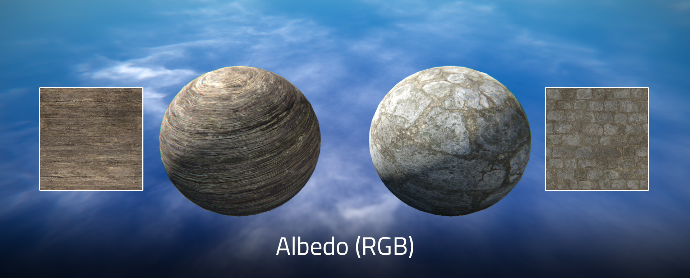
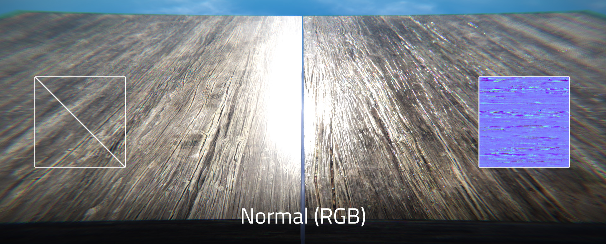
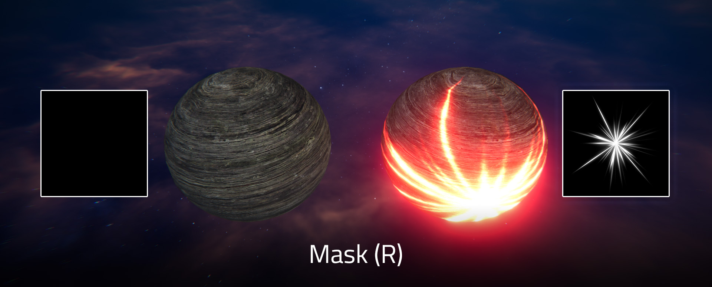
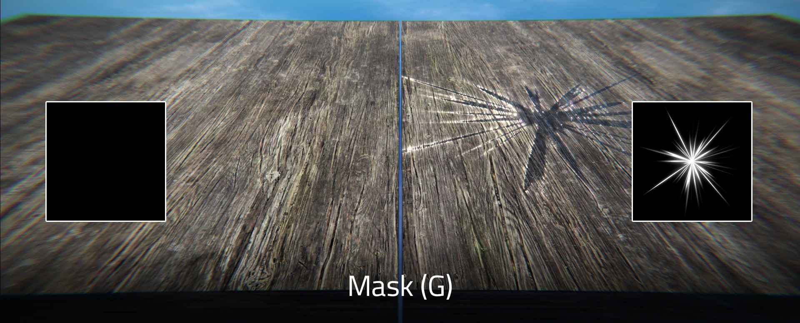
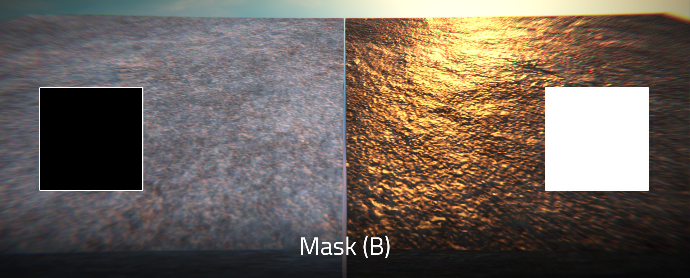
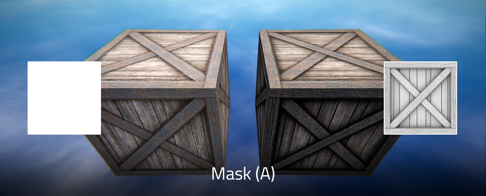

# 材质系统

## 准备贴图

BME Pro 的材质系统为蘑菇特制的 PBR 材质系统，每个材质包含三张 1024×1024 `.png` 贴图文件。

### 反照率贴图 Albedo

`RGB` 通道：表面颜色。（必需）
`A` 通道：表面纹理。该通道仅会在后续部分特效中起作用，如路面积水效果等。（可选，不使用留白色）

### 法线贴图 Normal

`RGB` 通道：表面法线方向。可以模拟出物体的凹凸感。（可选，不使用则不导入）
`A` 通道：~~暂无用途~~

::: tip

在 Adobe Photoshop 中，可以使用 `滤镜 → 3D → 生成法线图……` 功能生成法线贴图。

:::

### Mask

`R` 通道：自发光贴图 Emission。越接近白色自发光越强。（可选，不使用留黑色）

`G` 通道：光滑度贴图 Smoothness。越接近白色越光滑，光滑度将会影响材质的反光程度。（可选，不使用留黑色）

`B` 通道：金属度贴图 Metallic。越接近白色越体现金属反光特性。（可选，不使用留黑色）

`A` 通道：环境光遮蔽贴图 Ambient Occlusion。用于模拟角落等位置光线吸收的特性。（可选，不使用留白色）

## 贴图导入 BME

`File` → `Import File` 打开导入文件窗口
右下角文件类型选择为 `Image File (.png)`，并选择你想要导入的贴图导入。
重复几次，将需要的贴图全部导入进来。
导入后的贴图将以 `CustomImage` 的形式储存在工程文件中。

## 创建材质

`Create` → `Custom` → `Create Custom Material` 创建新的自定义材质，创建后将会显示在 `Hierarchy` 窗口中。
在改动下述参数后，需要点击 `Update Material` 按钮更新材质，材质预览将显示在 `Preview` 窗格中。

| 参数            | 类型                | 含义           | 补充说明                             |
| --------------- | ------------------- | -------------- | ------------------------------------ |
| `material`      | `Material`          | 材质名         | 无需改动                             |
| `albedo`        | `CustomImage`       | 反照率贴图     | 将导入的贴图拖入此处                 |
| `normal`        | `CustomImage`       | 法线贴图       | 将导入的贴图拖入此处                 |
| `mask`          | `CustomImage`       | 遮罩贴图       | 将导入的贴图拖入此处                 |
| `tilingScale`   | `float>0` `float>0` | 贴图拼贴缩放   | 控制贴图在材质上的缩放比例           |
| `tilingOffset`  | `float` `float`     | 贴图拼贴偏移   | 控制贴图在材质上的位置               |
| `emissionColor` | `Color`             | 自发光颜色     | 当自发光通道为全黑时无效             |
| `metallic`      | `float>=0,<=1`      | 金属度增益     | 在贴图的基础上继续增强金属度         |
| `smoothness`    | `float>=0,<=1`      | 光滑度增益     | 在贴图的基础上继续增强光滑度         |
| `ao`            | `float>=0,<=5`      | 环境光遮蔽增益 | 在贴图的基础上继续增强环境光遮蔽效果 |
